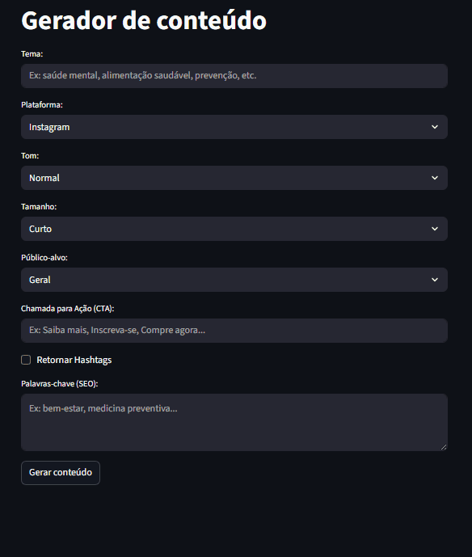

# 🤖 Gerador de Conteúdo para Marketing com IA

Aplicação web que utiliza **Inteligência Artificial (LLM)** para gerar automaticamente conteúdos de marketing **otimizados para SEO**, adaptados a diferentes plataformas digitais.

O objetivo do projeto é resolver um problema comum em empresas: a dificuldade de produzir conteúdo de forma **frequente, escalável e com qualidade**, sem aumentar custos ou depender exclusivamente de especialistas.

## 🎬 Demo


---

## 🎯 Problema que o projeto resolve

Empresas e profissionais de marketing enfrentam desafios como:
- Alto custo na produção de conteúdo
- Baixa escala e lentidão na criação manual
- Conteúdos pouco otimizados para SEO
- Dependência de conhecimento técnico em copywriting

Este projeto automatiza esse processo, permitindo a geração rápida de conteúdos prontos para uso em diferentes canais.

---

## 💡 Solução

O **Gerador de Conteúdo para Marketing com IA** utiliza um modelo de linguagem de grande porte (LLM) para criar textos personalizados, considerando:
- Plataforma de destino (Instagram, LinkedIn, Blog, etc.)
- Objetivo do conteúdo
- Boas práticas de SEO

A aplicação foi desenvolvida com foco em **uso corporativo**, oferecendo uma interface simples e acessível para usuários não técnicos.

---

## ✨ Funcionalidades

- Geração automática de conteúdo de marketing
- Textos personalizados conforme a plataforma
- Otimização para SEO desde a criação
- Interface web intuitiva e responsiva
- Execução rápida via navegador

---

## 🛠 Tecnologias utilizadas

- **Python**
- **Streamlit** (interface web)
- **LangChain**
- **Llama 3.3 70B**
- **Groq API**

---

## 🚀 Como executar o projeto localmente

### Pré-requisitos
- Python 3.10+
- Conta e chave de API da Groq

### Passos

```bash
# Clone o repositório
git clone https://github.com/silvaEndrew1/Gerador-Conteudo-Marketing.git

# Acesse a pasta do projeto
cd Gerador-Conteudo-Marketing

# Crie um ambiente virtual
python -m venv venv

# Ative o ambiente virtual
# Windows
venv\Scripts\activate
# Linux / Mac
source venv/bin/activate

# Instale as dependências
pip install -r requirements.txt

# Execute a aplicação
streamlit run app.py
```

### 👨‍💻 Autor

Endrew Silva

Desenvolvedor Python | Inteligência Artificial e Automação

GitHub: https://github.com/silvaEndrew1

LinkedIn: https://www.linkedin.com/in/endrew-silva-14734914a/


